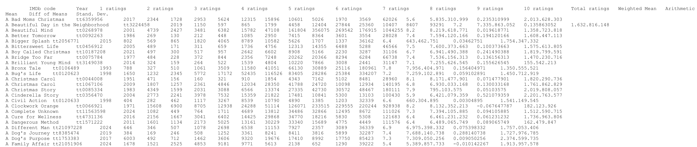
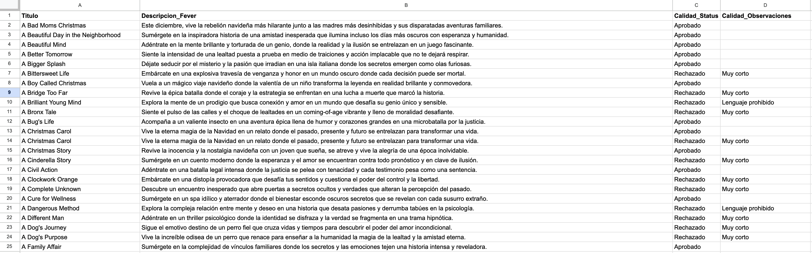

# SEO Content Enrichment Engine: AI-Powered Marketing Automation 🎬

This repository showcases a professional **content enrichment pipeline** that transforms raw dataset entries (IMDb movie lists) into persuasive, SEO-optimized marketing copy. The system is designed for high-volume processing, utilizing batching strategies to optimize LLM performance and automated quality assurance checks.

## ⚙️ Key Technical Features

* **Advanced ETL Processing:** Automatically downloads raw datasets from Google Drive, converts binary data to structured text, and extracts target entities using custom JavaScript.
* **Batching Optimization:** To reduce API latency and token consumption, the system processes data in batches of 25 items, striking the perfect balance between context window usage and execution speed.
* **AI Copywriting Agent:** Uses a "Expert Copywriter" persona to generate vibrant, mysterious, and persuasive "teaser" descriptions designed for entertainment platforms.
* **Automated Quality Assurance (QA):** A post-processing JavaScript engine evaluates AI output against strict business rules:
    * **Length Check:** Rejects descriptions under 120 characters.
    * **Forbidden Word Filter:** Automatically flags and "Rejects" content containing prohibited terminology.
* **Direct Database Integration:** Syncs final results to Google Sheets, categorizing entries as "Approved" or "Rejected" with specific quality observations for human review.

## 🛠️ Tech Stack
* **Orchestration:** n8n.
* **AI Model:** OpenAI ChatGPT 4o-mini (via LangChain).
* **Storage:** Google Sheets / Google Drive.
* **Languages:** JavaScript (for ETL and QA logic).

## 📊 Performance & Scalability Proof

### 1. Data Pipeline Architecture
The workflow handles the complete lifecycle: from raw file download to AI processing and final database entry.

### 2. Input vs. Output Integrity
The system processes massive raw lists (IMDb) and transforms them into structured marketing assets.

### 3. Automated Content Audit
The final output includes a "Quality Status" column, demonstrating the system's ability to self-audit AI-generated content.

## 🚀 Business Impact
* **TTFV (Time to First Value):** Capable of enriching 450+ product descriptions in minutes.
* **Cost Efficiency:** Batching logic significantly reduces API overhead compared to item-by-item processing.
* **Zero Supervision:** The integrated Guardrails ensure that only high-quality content reaches the final production stage.

---
*Note: This workflow is a prime example of how to scale creative departments by automating repetitive copywriting tasks with built-in quality control.*
